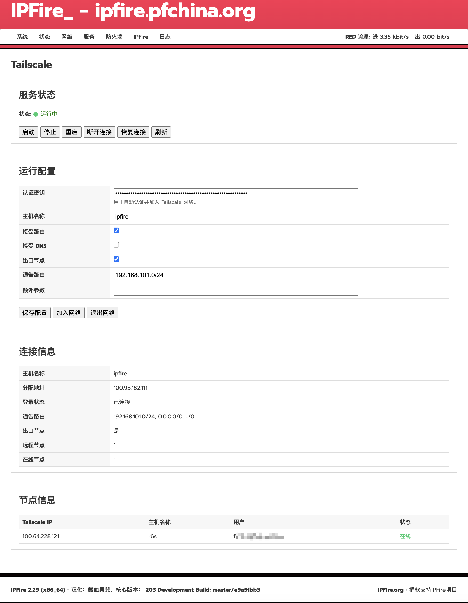

# Tailscale for IPFire


Tailscale for IPFire 为 IPFire 提供原生 Web 管理界面，可直接在 IPFire 管理后台中完成 Tailscale 的配置与管理。



## 功能特性

- 原生 IPFire Web UI 集成
- 使用认证密钥加入 Tailscale 网络
- 可以自定义主机名
- 支持配置子网路由、出口节点
- 自动识别平台架构，自动下载官方 Tailscale 静态二进制文件
- 支持英文、简体中文和繁体中文，其他语言自动回退到英文界面

## 支持平台

| 平台 | 版本 |
|------|------|
| IPFire | 2.29 Core Update 202 |
| 架构 | x86_64 / amd64 |

## 安装
```bash
sh install.sh
```
## 卸载
```bash
sh uninstall.sh
```
## 配置
安装完成后进入：
```text
服务> Tailscale
```
先点击启动，输入认证密钥，然后根据需要配置以下项目：

- 主机名
- 接受路由
- 通告路由
- 出口节点

保存选项后再点击：
```text
加入网络
```
完成后：
1. 打开 Tailscale 管理后台
2. 选择对应的 IPFire 设备
3. 设置禁用密钥过期、启用通告路由或出口节点选项

## Tailscale 二进制文件

安装程序会自动下载官方静态二进制文件：
https://pkgs.tailscale.com/stable/#static

## 注意事项

- 插件设置页面只能使用认证密钥进行自动部署。
- 通告路由和出口节点需要在 Tailscale 管理后台手动批准。
- 默认禁用 DNS 接管（`--accept-dns=false`），避免覆盖 IPFire 本地 DNS 配置。

## 免责声明

本项目为社区维护的非官方软件包，使用风险由用户自行承担。
