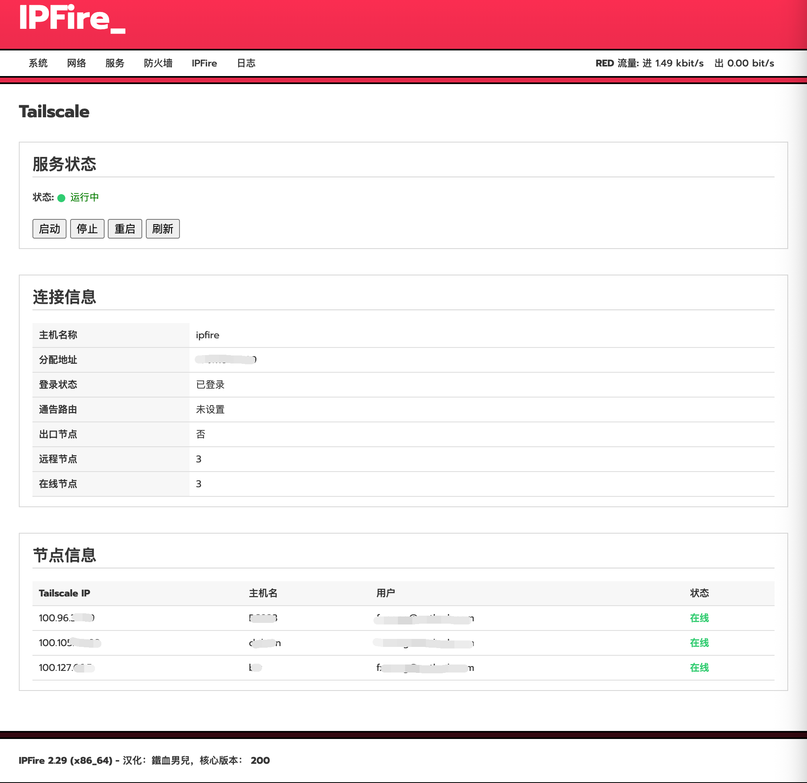

## Tailscale for OPNsense
适用于 IPFire 的 Tailscale 插件。在 IPFire 2.29 (x86_64) – Core Update 200 上测试通过。



## 集成程序
[tailscale](https://pkgs.tailscale.com/stable/#static)

[tailscaled](https://pkgs.tailscale.com/stable/#static)

## 注意事项
1. 当前仅支持 x86_64 平台，arm平台没做测试。

## 安装命令
```bash
sh install.sh
```
## 卸载命令
```bash
sh uninstall.sh
```
## 配置过程
1. 加入网络。安装完成后，输入以下命令注册并加入 Tailscale 网络：
```bash
/etc/init.d/tailscale up
```
首次执行会生成登录 URL，复制到浏览器完成认证。然后导航到 服务 → Tailscale，对Tailscale进行控制。

2. 通告路由。从外部访问 IPFrie 子网，需要添加通告路由。以访问子网192.168.101.0/24为例，需要执行以下命令：
```bash
tailscale up --advertise-routes=192.168.101.0/24 --accept-dns=false --accept-routes --hostname=ipfire
```
登录 Tailscale 管理后台，点击 IPFire设备列表右侧的Edit route setting，选中启用“ Subnet routes”。

3. 出口节点。如果把 IPFire 做为出口节点，需要执行以下命令：
```bash
tailscale up --advertise-exit-node --accept-dns=false --accept-routes --advertise-routes=192.168.101.0/24 --hostname=ipfire
```
登录 Tailscale 管理后台，点击 IPFire设备列表右侧的Edit route setting，选中启用 “Use as exit node”。

## 常用命令
- 启动服务：  /etc/init.d/tailscale start
- 停止服务：  /etc/init.d/tailscale stop
- 重启服务：  /etc/init.d/tailscale restart
- 加入网络：  /etc/init.d/tailscale up
- 断开连接：  /etc/init.d/tailscale down
- 退出网络：  /etc/init.d/tailscale logout
- 查看状态：  /etc/init.d/tailscale status
